---
adl_plugin:
  name: ADL FTP Plugin
  connects_to: FTP, FTPS and SFTP servers holding station data files (TOA5, SIAP+Micros, Standard CSV, and decoder plugins)
  category: general
  choose_when: Your stations upload data files to an FTP or SFTP server. It supports several file formats out of the box; check whether a country-specific decoder exists for your vendor.
---
# ADL FTP Plugin

Collects observation data from **files on an FTP, FTPS or SFTP server** —
the export directory of a data-logger network, a vendor's file drop, a
partner's SFTP account — and saves it into an ADL instance. This is a *pull*
plugin: on each collection cycle ADL connects to the server, finds the files
that belong to each linked station, downloads the ones it does not hold yet,
**decodes** them with the format decoder chosen on the connection, and stores
the mapped columns as observations. The same package also provides two
**dispatch channels** that push ADL observations *out* to an FTP/SFTP server
as CSV files.

**Repository:** [adl-ftp-plugin](https://github.com/wmo-raf/adl-ftp-plugin)
**Plugin type identifier:** `adl_ftp_plugin`
**Connection model:** `NetworkFTP` · **Station link model:** `FTPStationLink`
**Dispatch channels:** `FTPUpload` (*Standard FTP/SFTP Upload*) · `SmartMetFTPUpload` (*SmartMet FTP/SFTP Upload*)

> **About the screenshots.** Every image in this guide is regenerated from
> `docs/screenshots.yml` against a seeded demo instance, so hostnames, station
> names, ids and readings in them are placeholders — not values to copy. The
> field tables are the reference for what to enter.

## Overview

Three ideas carry the whole configuration:

| Idea | What it is | Where you set it |
|---|---|---|
| **Connection** | One server account: protocol, host, port, credentials, and the **decoder** every file on this connection is read with. | *Network FTP/SFTP* connection form |
| **Decoder** | The code that turns one downloaded file into records. Three ship with this plugin (TOA5, SIAP+Micros, Standard CSV); country plugins add more, and they appear in the same list. | *Decoder* select on the connection |
| **Listing strategy** | How the plugin finds each station's files in its remote directory: list everything matching a pattern, list and keep only the dated names in the run's window, or construct the expected filenames without listing at all. | *File Listing Strategy* on the station link |

```
FTP / FTPS / SFTP server
   │  list (or construct) filenames   ← station link: remote path, pattern, strategy
   │  download files not yet held      ← "Remote Station Data Files" store
   ▼
decoder (connection)  ──▶ records {observation_time, <column>: value, ...}
   ▼
variable mappings (connection, overridable per station) ──▶ ADL observations
```

One collection cycle, per enabled station link: connect once, resolve the
directories the run's time window touches, get the list of candidate files
for the strategy, download each file ADL does not already hold, decode it,
hand its records to ADL, and — only once ADL has written them — stamp the
file *processed* with the number of values saved. Files are kept locally for
seven days so a decode failure can be inspected and retried.

The plugin is the base of every **decoder plugin** in the ADL ecosystem (the
ADCON, Vaisala, LSI, KCSAP, NESA and buoy decoders): those packages add an
entry to the *Decoder* list and nothing else, so their guides refer back here
for everything about hosts, paths, strategies and monitoring.

## Prerequisites

- A running ADL instance (see [Installation](https://adl-tool.readthedocs.io/en/latest/installation.html)).
- An **account on the file server**: host name or IP, port, username, and a
  password or (SFTP only) a private key file. Ask the party operating the
  server — the data-logger vendor, your IT department, or the partner whose
  SFTP account you were given.
- The **directory** the station files land in, and how they are named. A
  directory listing from an FTP client, or a couple of sample files, is
  enough to fill the station link form.
- **Outbound network access** from the ADL host to the server: TCP port 21
  for FTP/FTPS (plus the server's passive data-port range, which the server
  operator can tell you), or port 22 for SFTP. Any non-default port you are
  given instead. Check this first on networks with restrictive firewalls —
  the *Ingestion Diagnostic* page (below) reports exactly which of DNS, TCP
  reach and login fails.
- For a **Standard CSV** source, a sample file so you can describe its
  columns and date format in a *CSV Decoder Configuration*.
- For a **decoder plugin** (ADCON, Vaisala, …), that plugin installed as well
  — its own guide names the version to use.

## Installation

Installed like any ADL plugin — see [Plugin Installation](https://adl-tool.readthedocs.io/en/latest/developer_guide/plugins/plugin_installation.html) for
all methods. The `plugins.toml` entry:

```toml
[[plugins]]
name = "ADL FTP Plugin"
git  = "https://github.com/wmo-raf/adl-ftp-plugin.git"
tag  = "0.13.0"
```

After rebuild/restart, confirm with `docker compose exec adl list-plugins`.
Decoder plugins go **after** this entry in `plugins.toml`, since they import
from it.

## Connection configuration

In the ADL admin, create a new **Network FTP/SFTP** connection. Base
connection fields (name, network, plugin, processing interval, stations
timezone) are described in [Manage Connections](https://adl-tool.readthedocs.io/en/latest/user_guide/manage_connections.html).
The plugin-specific fields follow, in the order the form shows them. The
form hides the sections that do not apply: choosing **SFTP** hides *FTP/FTPS
Settings* and shows *SFTP Settings*, and vice versa; *CSV Configuration*
appears only when the decoder is *Standard CSV*.

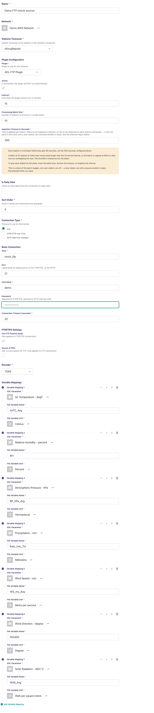

| Field | Required | Default | Description |
|---|---|---|---|
| Connection Type | yes | FTP | **FTP** (plain), **FTPS (FTP over TLS)**, or **SFTP (SSH File Transfer)**. Pick what the server operator told you; SFTP is not "secure FTP" but a different protocol on port 22. |
| Host | yes | — | Server host name or IP address, without a scheme or path (`ftp.example.org`, `10.20.30.40`). This is the host the network diagnostic dials. |
| Port | no | 21 / 22 | Leave blank for the protocol default (21 for FTP and FTPS, 22 for SFTP). |
| Username | yes | — | The account name on the server. |
| Password | FTP/FTPS: yes; SFTP: yes unless a private key is given | — | Stored as entered; masked in this guide's screenshots. |
| Connection Timeout (seconds) | yes | 20 | How long a connect, login, listing or download may wait on the server before the run fails. Raise it for slow links; the on-demand diagnostic checks use their own 5-second bound regardless. |
| Use FTP Passive mode | no | on | FTP/FTPS only. Passive mode works through almost every firewall and NAT; turn it off only if the server operator says the server is active-mode only. |
| Secure (FTPS) | no | off | FTP/FTPS only. Encrypts the control and data channels with TLS. **Takes effect only when Connection Type is FTPS as well** — with type FTP this box is ignored. The server certificate is not verified. |
| Private Key File Path | no | — | SFTP only. Path *inside the ADL container* to an SSH private key (RSA, DSA, ECDSA or Ed25519, unencrypted). Mount the key into the container and give its path here; leave empty to log in with the password. |
| Host Key Policy | yes | Auto-accept (less secure) | SFTP only. What to do when the server's SSH host key is not known: **Auto-accept** trusts it, **Warn but connect** logs a warning and continues, **Reject unknown hosts** refuses. The container has no persistent `known_hosts`, so *Reject* refuses every connection unless you provision one. |
| Look for SSH Keys | no | off | SFTP only. Also try keys found in the container user's `~/.ssh/`. |
| Allow SSH Agent | no | off | SFTP only. Also try an SSH agent if one is reachable from the container. |
| Decoder | yes | — | The file format of **every** file on this connection — see *Choosing a decoder* below. A server holding two formats needs two connections. |
| CSV Configuration | when Decoder is Standard CSV | — | The *CSV Decoder Configuration* describing the columns and date format. Choose an existing one or create one from the chooser. |
| Variable Mappings | at least one, unless every station defines its own | — | The connection-wide translation from file columns to ADL parameters — see *Connection-level variable mappings*. |

Saving is refused with a message under the field when the combination is
incomplete:

| Message | Fix |
|---|---|
| `Password is required for FTP/FTPS connections` | Enter the password. |
| `Password or private key file is required for SFTP connections` | Enter one of the two. |
| `CSV Configuration is required when using 'Standard CSV' decoder` | Pick or create a CSV Decoder Configuration. |

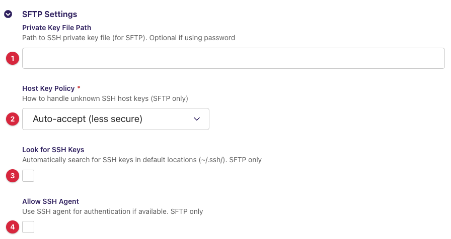

### Choosing a decoder

The *Decoder* list contains the three decoders below plus one entry per
installed decoder plugin. Choose by the format of the files, not by the
vendor of the server.

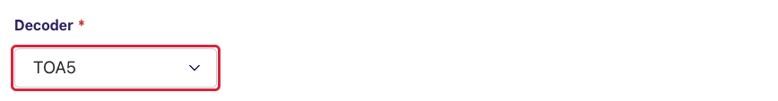

| Decoder | Files it reads | Record keys it produces (what you enter as *File Variable Name*) |
|---|---|---|
| **TOA5** | Campbell Scientific data-logger tables in TOA5 format (`.dat`). | The column headers of the file's second line, e.g. `AirTC_Avg`, `RH`, `BP_hPa_Avg`, `Rain_mm_Tot`. |
| **SIAP+Micros** | SIAP+Micros data-logger export lines (comma-separated, one observation per line, `#<n>` field-count terminator). | `<parameter id>_<type letter>`, e.g. `105_B` — see the format notes below. |
| **Standard CSV** | Any delimited text file with a header row (or fixed column positions) and a parseable date/time column. **Needs a CSV Decoder Configuration.** | The column headers, or `column_1`, `column_2`, … for headerless files. |
| Decoder plugins | Formats specific to one vendor or country. | See each plugin's guide. |

Decoder plugins known at the time of writing, with the name they add to the
list:

| Decoder entry | Plugin | Guide |
|---|---|---|
| ADCON FTP Burkina Faso | [adl-ftp-adcon-bf-plugin](https://github.com/anam-bf/adl-ftp-adcon-bf-plugin) | [guide](https://github.com/anam-bf/adl-ftp-adcon-bf-plugin/blob/main/docs/guide.md) |
| ADCON FTP Somalia | [adl-ftp-adcon-som-plugin](https://github.com/wmo-raf/adl-ftp-adcon-som-plugin) | [guide](https://github.com/wmo-raf/adl-ftp-adcon-som-plugin/blob/main/docs/guide.md) |
| KCSAP / KMD AWS | [adl-kmd-kcsap-ftp-decoder](https://github.com/wmo-raf/adl-kmd-kcsap-ftp-decoder) | repository README |
| Vaisala Avimet FTP Decoder - Seychelles | [adl-vaisala-sc-ftp-decoder](https://github.com/seychelles-met/adl-vaisala-sc-ftp-decoder) | repository README |
| Vaisala (Sudan) | [adl-vaisala-sudan-ftp-decoder](https://github.com/wmo-raf/adl-vaisala-sudan-ftp-decoder) | repository README |
| LSI Decoder - Burundi | [adl-lsi-bi-ftp-decoder](https://github.com/meteo-burundi/adl-lsi-bi-ftp-decoder) | repository README |
| NESAMZ FTP Decoder - Mozambique | [adl-mz-nesa-decoder](https://github.com/inam-mz/adl-mz-nesa-decoder) | repository README |
| Bouy Decoder - Seychelles | [adl-bouy-sc-ftp-decoder](https://github.com/seychelles-met/adl-bouy-sc-ftp-decoder) | repository README |

Whatever the decoder, the quickest way to see the record keys it produces
from *your* files is the **Test Decoder Configuration** page (see *Admin UI
added by this plugin*): upload one file and read the column headers of the
preview table.

#### TOA5 format notes

A TOA5 file has four header lines followed by data rows, all comma-separated:

```
"TOA5","DEMO001","CR1000","12345","CR1000.Std.32","AWS.CR1","1234","Table1"
"TIMESTAMP","RECORD","AirTC_Avg","RH","BP_hPa_Avg","Rain_mm_Tot","WS_ms_Avg","WindDir","SlrW_Avg"
"TS","RN","Deg C","%","hPa","mm","meters/second","degrees","W/m^2"
"","","Avg","Smp","Avg","Tot","Avg","Smp","Avg"
"2025-09-07 10:00:00",1201,24.3,61,1012.4,0,2.1,135,612
```

- Line 1 must start with `TOA5` and have eight fields (format, station name,
  logger type, serial number, OS version, program name, program signature,
  table name); the *Test Decoder Configuration* page shows them as *File
  Header Information*.
- Line 2 gives the column names, line 3 their units, line 4 the processing
  (Avg, Smp, Tot, …); the test page shows lines 3–4 as *Column Metadata*,
  which is where you read the *File Variable Unit* for each mapping.
- `TIMESTAMP` (`YYYY-MM-DD HH:MM:SS`) becomes the observation time. Every
  other column whose value parses as a number becomes a record key; empty
  cells and non-numeric cells are left out of that row. If a timestamp
  appears twice in one file, the later row wins.
- Loggers that append to one growing file per station are the normal case:
  use the *Pattern Only* strategy and leave *Skip downloading already
  downloaded files* **off** (see *Station link configuration*).

#### SIAP+Micros format notes

Each line is one observation from one station, comma-separated, and ends
with a `#<count>` field giving the number of fields on the line:

```
0001,00,10.00.00,07,09,2025,0,M03,105,B,24.3,106,A,61.0,230,B,1012.4,#17
```

- Field 1 is the station id (kept in the record as `station_id`), field 3 the
  time as `HH.MM.SS`, fields 4–6 day, month and year.
- Field 8, `M<n>`, says how many parameter blocks follow. Each block is three
  fields: **parameter id**, **value type** (`A` instantaneous, `B` average,
  `C` minimum, `D` maximum) and the value.
- The record key for a block is `<parameter id>_<value type>` — map
  `105_B` for the average of parameter 105, `105_D` for its maximum. Values
  that are not numeric are stored as missing.
- A line whose field count does not match its `#` terminator, or whose block
  count does not match `M<n>`, fails the whole file with an error naming the
  mismatch.

#### Standard CSV format notes

The Standard CSV decoder reads whatever a *CSV Decoder Configuration*
describes: delimiter, rows to skip, whether the first row is a header, and
how the observation time is written — one datetime column, or a date column
plus a time column. All other columns become record keys; numeric values are
stored as numbers, the configured *No Data Value* becomes missing, and
non-numeric text is passed through unchanged (ADL then ignores it for a
numeric parameter). Rows that fail to parse are skipped with a warning in the
task log, never the whole file. Creating and testing a configuration is
covered under *Admin UI added by this plugin*.

### Connection-level variable mappings

Every mapping row ties one record key emitted by the decoder to one ADL data
parameter. Rows defined here apply to **every** station on the connection; a
station link can override individual rows (see *Station-level variable
mappings*).

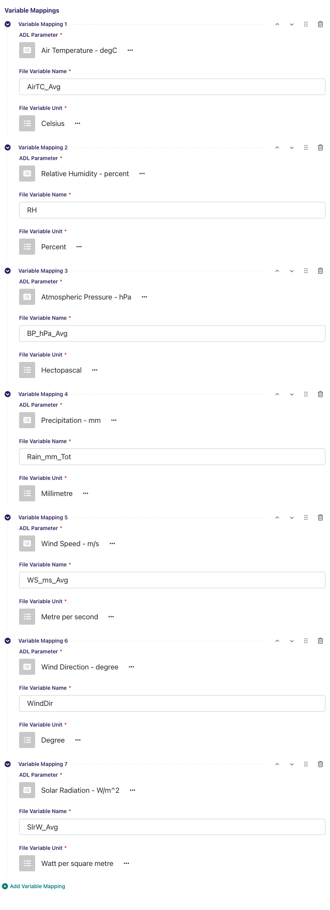

| Field | Description |
|---|---|
| ADL Parameter | The ADL `DataParameter` the values are stored under (see [Manage Data Parameters](https://adl-tool.readthedocs.io/en/latest/user_guide/manage_data_parameters.html)). |
| File Variable Name | The record key **exactly** as the decoder emits it — for TOA5 and Standard CSV the column header, character for character, including case, spaces and units baked into the name (`AirTC_Avg`, not `AirTC`). |
| File Variable Unit | The unit the file's values are in. ADL converts from this unit to the ADL parameter's unit, so it must be what the logger actually writes — for TOA5 read it off the file's third line. |

**Example:** ADL Parameter `Air Temperature` ← File Variable Name
`AirTC_Avg`, unit `degC`; ADL Parameter `Precipitation` ← `Rain_mm_Tot`,
unit `mm`.

Only mapped keys are stored: a file may carry forty columns, ADL keeps the
mapped ones. A key that matches no mapping is silently ignored, which is why a
file that "processes fine" but saves 0 values almost always has a spelling
difference between the header and the mapping — the *Test Decoder
Configuration* page marks mapped columns in its preview so the difference is
visible.

## Station link configuration

For each station to collect, create an **FTP/SFTP Station Link**. Base fields
(network connection, station, enabled, timezone) are the core's; the
aggregation fields at the bottom of the form are described in
[Manage Connections](https://adl-tool.readthedocs.io/en/latest/user_guide/manage_connections.html).
The plugin's own fields are grouped in panels, and the form shows and hides
panels as you change *Directory Structured by Date* and *File Listing
Strategy*:

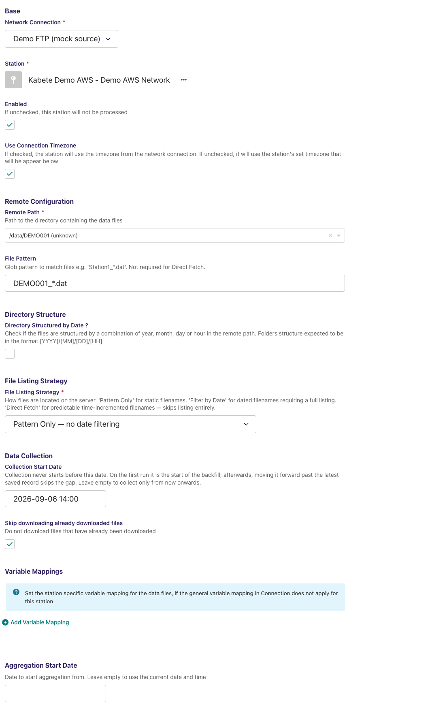

| Field | Required | Default | Description |
|---|---|---|---|
| Remote Path | yes | — | The directory on the server holding this station's files, as an absolute path (`/data/DEMO001`). Pick it in the directory tree that loads from the selected connection (see *Remote path browser*) or type it. With *Directory Structured by Date* on, this is the **root** of the date tree. |
| File Pattern | Pattern Only and Filter by Date: yes | — | A shell glob the file names must match: `DEMO001_*.dat`, `*.csv`, `Station1_2025*.txt`. Matched against the bare file name, not the path. Hidden for *Direct Fetch*, which builds the names itself. |
| Directory Structured by Date ? | no | off | Turn on when the server files data under sub-directories named by date: `<Remote Path>/2025/09/07/…`. |
| Date Granularity | when structured by date | — | How deep the date tree goes: **Year** (`/2025`), **Month** (`/2025/09`), **Day** (`/2025/09/07`) or **Hour** (`/2025/09/07/10`). The run lists one directory per period in its window. Directory names are built in the station's timezone. |
| Month directory Format | when structured by date | `01`–`12` | How the month directory is spelled: two digits (`09`), no leading zero (`9`), `Sep`, `sep`, `September`, `september`. |
| File Listing Strategy | yes | Pattern Only | **Pattern Only**, **Filter by Date** or **Direct Fetch** — see *Listing strategies* below. Decides which of the next two panels apply. |
| Filename Date Format | Filter by Date: yes | — | The date, or date-and-time, written at the **end** of each file name (just before the extension), chosen from the list in *Filename date formats*. |
| Filename Date Timezone | Filter by Date | UTC | The timezone those filename dates are written in — usually the logger's local time. Only affects which files fall inside the run's window. |
| File Prefix | Direct Fetch: yes | — | Everything in the file name before the datetime: for `STATION_001_202609191220.txt` the prefix is `STATION_001_`. |
| File Datetime Format | Direct Fetch: yes | — | The datetime embedded in the file name, from the same list as *Filename Date Format*. |
| File Interval (minutes) | Direct Fetch: yes | — | How often a new file is produced: `10` for a file every ten minutes, `60` hourly. The plugin generates one expected name per interval step. |
| File Datetime Timezone | Direct Fetch | UTC | The timezone of the datetime in the file name. Ask the data provider whether file names carry local time or UTC — a wrong choice looks for files that do not exist yet, or that are hours old. |
| File Extension | Direct Fetch | `.txt` | The extension including the dot (`.txt`, `.csv`, `.dat`). |
| Collection Start Date | no | empty | Collection never starts before this date, and it must be in the past. On the first run it is the start of the backfill; afterwards, moving it forward past the latest saved record skips the gap. **Leave empty and the first run starts from now** — nothing older is fetched. |
| Skip downloading already downloaded files | no | on | With this on, a file name ADL already holds for this station is not downloaded again; the held copy is decoded instead. Turn it **off** for sources whose files *grow* (a logger appending to one file per station, or per day), so the current file is re-downloaded on every run. Rows already saved are updated, not duplicated. |
| Variable Mappings | no | — | Station-specific overrides — see *Station-level variable mappings*. |

Saving is refused with a message under the field when the strategy's fields
are incomplete:

| Message | Fix |
|---|---|
| `File pattern is required for Pattern Only and Filter by Date strategies` | Enter a *File Pattern*. |
| `Filename date format is required when using Filter by Date strategy` | Choose a *Filename Date Format*. |
| `File prefix is required when using Direct Fetch strategy` | Enter the *File Prefix*. |
| `File interval is required when using Direct Fetch strategy` | Enter the *File Interval (minutes)*. |
| `Datetime format is required when using Direct Fetch strategy` | Choose the *File Datetime Format*. |
| `Start date should be in the past` | The *Collection Start Date* is in the future. |

### Listing strategies

The strategy decides how the plugin finds files. Choose from how the
server names them:

**Pattern Only — no date filtering.** Every run lists the remote directory
(or, with a date-structured tree, every period directory from the window
start to now) and takes every name matching *File Pattern*. Nothing in the
name is interpreted. Use it for a logger that appends to one file per
station (`DEMO001.dat`), or when files are few and a date-structured tree
already narrows them by day. Combined with *Skip downloading already
downloaded files* **off**, this is the configuration for growing files.

**Filter by Date — list all files, filter by date in filename.** Every run
lists the directory the same way, keeps the names matching *File Pattern*,
then reads the date at the end of each name (in *Filename Date Format* and
*Filename Date Timezone*) and keeps only those inside the run's window. Use
it for one-file-per-day or one-file-per-hour exports in a directory that
accumulates months of history: `DEMO002_20250907.dat`,
`obs_2025-09-07-10.csv`. Names whose tail does not parse in the chosen format
are dropped — a pattern that also matches a summary file with a different
name shape is fine, that file is simply never selected.

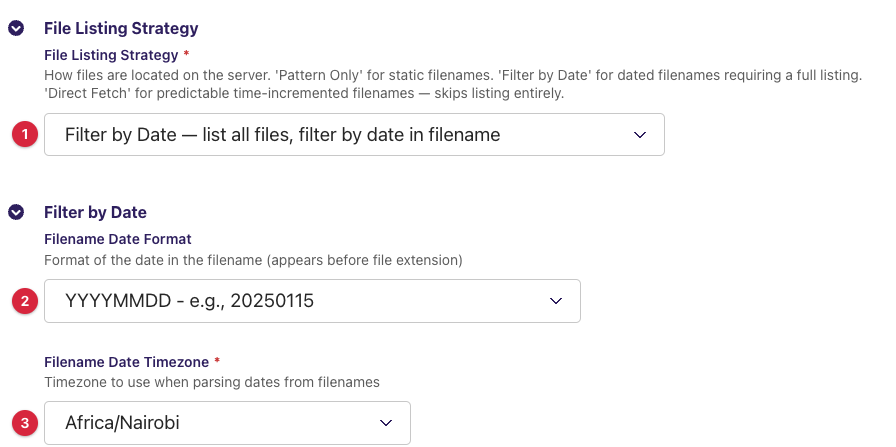

**Direct Fetch — construct filenames from time increment, no listing.** The
plugin never lists the directory. From the window start to now, in steps of
*File Interval*, it builds `<File Prefix><datetime in File Datetime
Format><File Extension>` and tries to download each one; a name the server
does not have is skipped quietly. Use it when the export produces a file at
a fixed cadence with a fully predictable name (`STATION_001_202509071220.txt`
every ten minutes) — especially on servers where listing a directory of
tens of thousands of files is slow or forbidden. Because no listing happens,
the *Direct Fetch Files* preview page (see *Admin UI*) exists to show you
what names the next run will try before you enable the link.

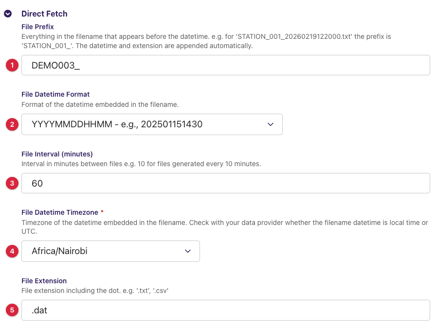

With **Directory Structured by Date** on, all three strategies place each
period's files in its own directory. Pattern Only and Filter by Date list one
directory per period in the window; Direct Fetch derives each file's
directory from that file's own timestamp, so a file at 23:50 local time is
looked for in that day's directory even when the file name is written in UTC.

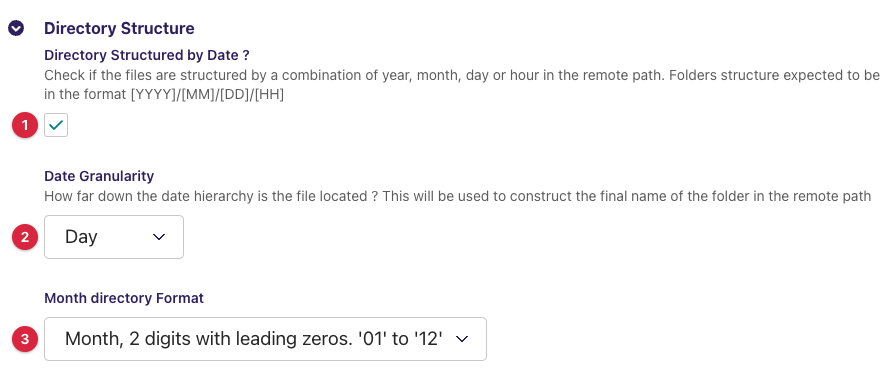

### Filename date formats

*Filename Date Format* and *File Datetime Format* share one list. The plugin
reads the **last N characters of the file name before its extension**, where
N is the format's length, so anything before the date is ignored and the date
must be the last thing in the name (`DEMO002_20250907.dat`, not
`20250907_DEMO002.dat`). Formats with a time component filter to the minute;
date-only formats filter by calendar day.

| Group | Formats |
|---|---|
| Compact | `YYYYMMDD`, `YYYYMMDDHH`, `YYYYMMDDHHMM`, `YYYYMMDDHHMMSS`, `YYMMDD`, `YYMMDDHHMM`, `DDMMYYYY`, `MMDDYYYY`, `DDMMYY`, `MMDDYY`, `YYYYMMDD_HHMMSS` |
| Hyphenated | `YYYY-MM-DD`, `YYYY-MM-DD-HH`, `YYYY-MM-DD-HHMM`, `YYYY-MM-DD-HHMMSS`, `DD-MM-YYYY`, `MM-DD-YYYY`, `YY-MM-DD` |
| Underscored | `YYYY_MM_DD`, `YYYY_MM_DD_HH`, `YYYY_MM_DD_HHMM`, `YYYY_MM_DD_HHMMSS`, `DD_MM_YYYY`, `MM_DD_YYYY` |
| Dotted | `YYYY.MM.DD`, `DD.MM.YYYY`, `MM.DD.YYYY` |
| ISO with `T` | `YYYY-MM-DDTHH`, `YYYY-MM-DDTHHMMSS`, `YYYY-MM-DDTHH:MM:SS` |
| Day of year | `YYYYDDD`, `YYDDD` |
| Month only | `YYYYMM`, `YYYY-MM`, `YYYY_MM` |
| Month names | `YYYY-MMM-DD`, `DD-MMM-YYYY`, `YYYYMMMDD`, `DDMMMYYYY` (`Sep`) |
| Unix epoch | `TIMESTAMP` (ten-digit seconds) |

Each option in the select shows an example value next to its name.

### Station-level variable mappings

The *Variable Mappings* panel on the station link has the same three fields
as the connection's (ADL Parameter, File Variable Name, File Variable Unit).
Rows here are merged with the connection's rows **per ADL parameter**: a
station row for *Air Temperature* replaces the connection's *Air Temperature*
row for this station only, and every other connection row still applies.
Use it for the one station whose logger program names a column differently,
or reports it in another unit. A station that needs a completely different
set of mappings can leave the connection's list empty and define everything
here.

### Remote path browser

*Remote Path* is not a plain text box: once a *Network Connection* is
selected above it, the field shows a **directory tree** loaded live from that
server (root first; each folder's children load when you expand it), and
clicking a folder fills the path. A spinner shows while a level loads. If the
server cannot be listed, the message from the server replaces the tree — the
same messages as in the *Feedback catalogue* below (`FTP Authentication
failed`, `Could not resolve FTP host`, …), or `Connection not found` when the
selected connection is not an FTP connection. Fix the connection, then reload
the form.

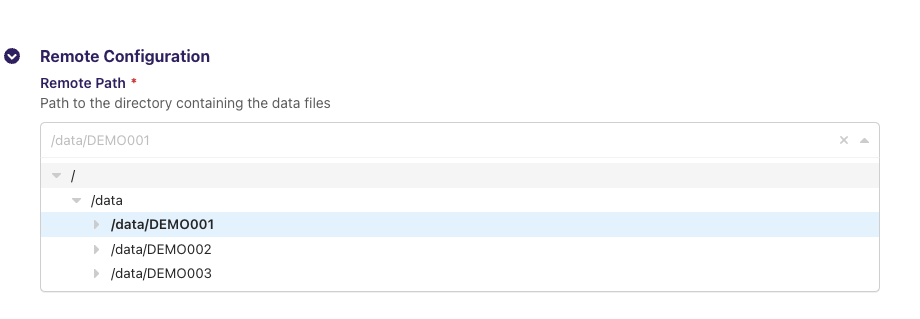

## Admin UI added by this plugin

Beyond its connection and station link forms, the plugin adds five surfaces
to the ADL admin. Each is walked through below.

| Surface | Where it appears | What it is for |
|---|---|---|
| **Test Decoder Configuration** | Connection row's **…** menu; also *Settings → FTP Settings → Test Decoder Config* | Decode one uploaded file with a connection's decoder and see the records and column names before configuring mappings. |
| **CSV Decoder Configurations** | *Settings → FTP Settings → CSV Decoder Configurations*; the chooser on the connection form; the **CSV Config** row action | Create and edit the column/date descriptions the Standard CSV decoder needs. |
| **Populate Variable Mappings from Decoder** | Connection row's **…** menu, only for decoders that declare their variables (none of the three built-in ones; some decoder plugins do) | Seed the connection's variable mappings from the decoder's declared variable list. |
| **Direct Fetch Files** | Station link row's **…** menu and the Inspect page header, only for *Direct Fetch* links | Preview the file names the next run will try, and ask the server which of them exist. |
| **Remote Station Data Files** | *Snippets → Remote Station Data Files* | Every file downloaded, with when it was processed and how many values were saved. |

### Entry point — the connection row actions

On the **Network Connections** list, open the **…** menu of a *Network
FTP/SFTP* row. **Test Decoder Configuration** is always there (it opens in a
new tab); **CSV Config** appears when the decoder is *Standard CSV* and a
configuration is set; **Populate Variable Mappings from Decoder** appears when
the decoder declares its variables.

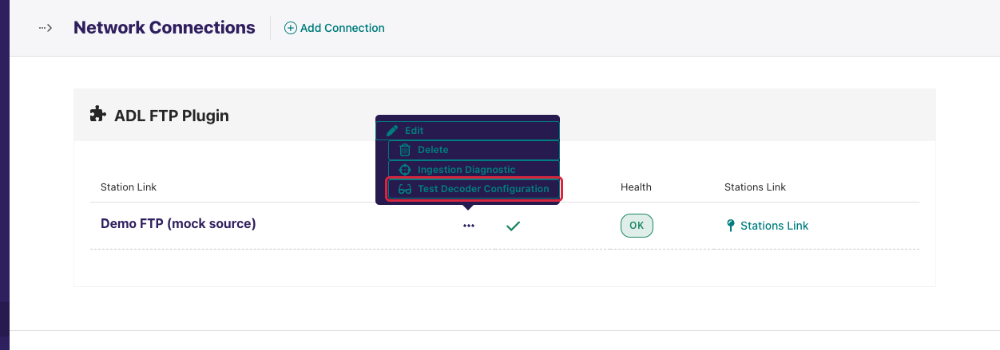

### Test Decoder Configuration

The page has three fields and a **Parse File** button:

| Field | Description |
|---|---|
| Connection | The connection whose decoder (and CSV configuration, and variable mappings) to test with. Pre-selected when you came from a row action. Only connections with a decoder set are listed. |
| Data File | One file from the server, up to 10 MB (`.csv`, `.txt`, `.dat`). Download it with any FTP client, or take it from *Remote Station Data Files*. |
| Show only mapped variables | Tick to hide the columns that have no variable mapping on the connection, so the preview shows exactly what ADL would store. |

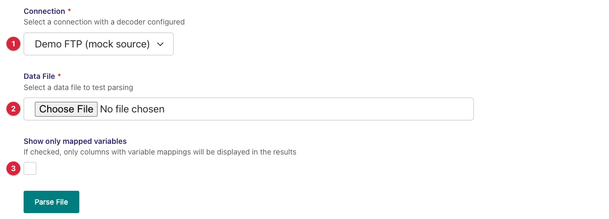

After *Parse File*, a green banner reads `Successfully parsed 144 records
from the file using TOA5 decoder`, and the **Parsing Results** appear:

1. **Summary block** — Connection, Decoder, CSV Configuration (Standard CSV
   only), Total Records Parsed, and Total Columns with the number of them
   that are mapped (or, with the checkbox on, *Columns Displayed: mapped /
   total*). More than 100 records shows the first 100.
2. **File Header Information** (TOA5 only) — the eight fields of the first
   line: format, station id, datalogger type, serial number, OS version,
   program name and signature, table name.
3. **Column Metadata** (TOA5 only) — one row per column with its **Unit** and
   **Processing** from the file's third and fourth lines. This is where the
   *File Variable Unit* of each mapping comes from.
4. **Variable Mappings** — the connection's current mappings: File Column,
   ADL Parameter, Unit. A column present in the preview but absent here is
   not stored.
5. **Parsed Data Preview** — one row per record: **Observation Time** as
   decoded, then one column per record key; a mapped column shows its ADL
   parameter name under the header. Compare the headers here with your
   mapping's *File Variable Name* values character for character.

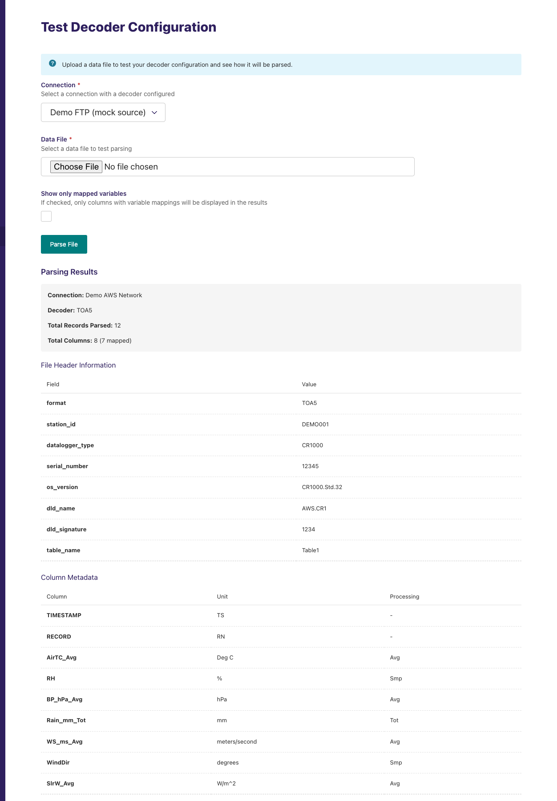

Messages the page can show instead of results:

| Message | Meaning | What to do |
|---|---|---|
| `No data was parsed from the file. Please check your decoder configuration.` | The decoder ran but produced no records — wrong decoder for the file, or (Standard CSV) a configuration whose skipped rows or datetime column leave nothing to read. | Check the file against the format notes above; for Standard CSV open the configuration. |
| `Error parsing data file: <error>` | The decoder raised — the wrapped text names the cause: `The file format is not TOA5.`, `The header does not contain the required number of fields.`, `Datetime column 'Date' not found in CSV. Available columns: …`, `time data '07/09/2025' does not match format '%Y-%m-%d'`, … | Fix the decoder choice or the CSV configuration to match the file. |
| `Decoder 'standard_csv' selected but no CSV configuration set` | The connection uses Standard CSV without a configuration. | Set *CSV Configuration* on the connection. |
| `Decoder '<name>' not found in registry` | The connection names a decoder whose plugin is no longer installed. | Reinstall the decoder plugin or choose another decoder. |
| `Connection with ID 7 not found or has no decoder configured` | The row action pointed at a connection that has since lost its decoder. | Choose the connection in the form. |
| `File size must not exceed 10MB` | The upload is too large. | Test with a smaller file — a day's worth of rows is enough. |

### CSV Decoder Configurations

Open **Settings → FTP Settings → CSV Decoder Configurations** for the list,
or use the chooser next to *CSV Configuration* on the connection form, which
offers *Choose CSV Configuration* and, once one is set, *Edit this CSV
Configuration*. A configuration is reusable across connections.

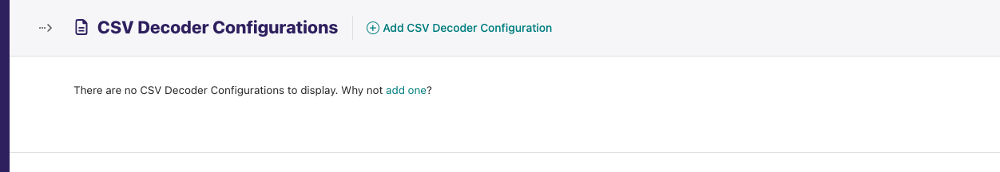

The form, with its panels:

| Field | Required | Default | Description |
|---|---|---|---|
| Configuration Name | yes | — | A name you will recognise in the chooser (`Vendor X hourly export`). |
| File has header row | no | on | The first row (after skipped rows) names the columns. Off: columns are called `column_1`, `column_2`, … in file order, and those are the *File Variable Name* values to map. |
| CSV Delimiter | yes | Comma | Comma, Tab, Semicolon, Pipe, Space or Colon. |
| Skip Rows | yes | 0 | Rows to ignore before the header (title lines, blank lines, a units line *above* the header). |
| No Data Value | no | — | A number the file writes for a missing observation (`-9999`, `999.9`); cells equal to it are stored as missing. |
| Datetime Mode | yes | Single datetime column | Whether the observation time is one column or a date column plus a time column. The form shows only the matching settings panel. |
| Datetime Column Name | single mode: yes | — | The header of the datetime column (`TIMESTAMP`, `DateTime`). |
| Datetime Format | single mode | `2025-01-15 14:30:45` | The format the column is written in, chosen from a list of common layouts; each option shows an example. |
| Date Column Name / Date Format | separate mode: yes | `2025-01-15` | The date column and its format. |
| Time Column Name / Time Format | separate mode: yes | `14:30:45` | The time column and its format. |

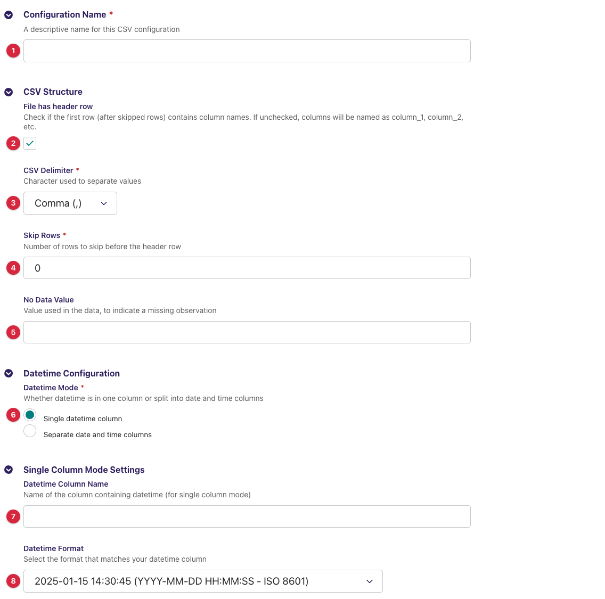

Saving is refused with `Datetime column name is required for single column
mode`, or `Date column name is required for separate columns mode` / `Time
column name is required for separate columns mode`, when the mode's column
names are empty. After saving, test it: set it on a connection and run *Test
Decoder Configuration* with a sample file.

### Populate Variable Mappings from Decoder

Some decoder plugins declare the variables they emit, with units and a
suggested ADL parameter for each. For a connection using such a decoder the
row action **Populate Variable Mappings from Decoder** opens a review page:

1. The information block reads `Decoder <name> declares 12 variables; 4 are
   already mapped on this connection. The rows below are the unmapped ones.`
2. The table has one row per unmapped variable: **Include** (ticked),
   **File Variable** (the record key and its label), **File Variable Unit**
   (an existing ADL unit matching the declared symbol is pre-selected;
   otherwise the option reads *Create unit '<symbol>'*), and **ADL
   Parameter** (an existing parameter with the same name is pre-selected;
   otherwise *Create new: <label> (<unit>)*).
3. Untick rows you do not want; **Select all / none** toggles them.
4. **Create mappings** creates any missing units and parameters and the
   mapping rows in one step, then returns to the connection with the banner
   `Created 8 variable mapping(s) — 2 new unit(s), 3 new parameter(s); 4
   already mapped.` Re-running is safe: already mapped variables are skipped.

A row that pairs a file unit with a parameter in an incompatible unit is
refused with `'<file unit>' cannot be converted to '<parameter unit>'`. A
decoder that declares nothing shows `Decoder '<name>' does not declare any
variables, so mappings cannot be pre-populated.` — for those, type the
mappings by hand using the *Test Decoder Configuration* preview as the
reference. When everything is mapped the page reads `All variables declared
by this decoder are already mapped on this connection.`

### Direct Fetch Files

For a station link whose strategy is *Direct Fetch*, the station links list
row and the Inspect page header carry a **Direct Fetch Files** action. On the
list it sits beside *View Data* in the row itself, not in the row's *More
options* menu; both appear only on links using this strategy.
It answers "which file names will the next run try, and does the server have
them?" without touching the server unless you ask it to.

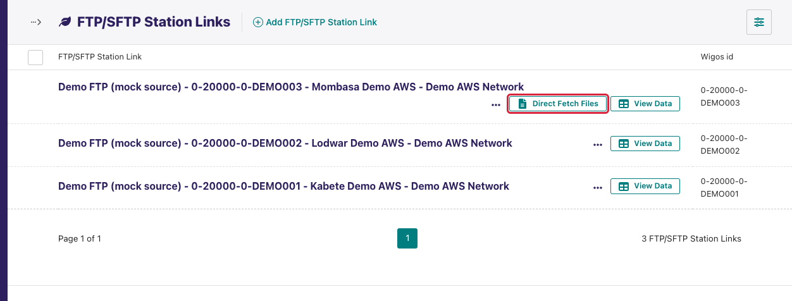

The page:

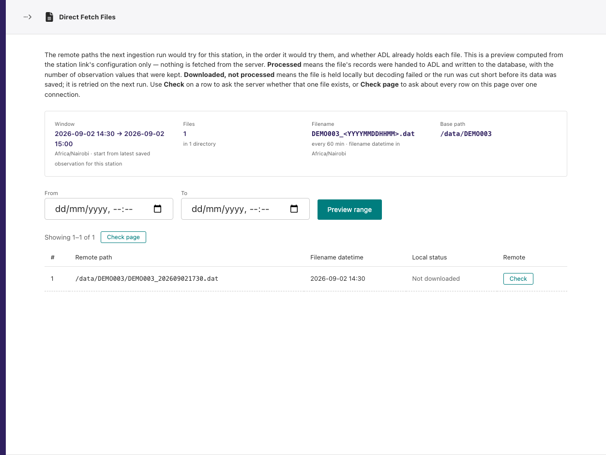

1. **Summary block.** *Window* — the start and end the next run would use,
   in the station's timezone, with where the start came from (*start from
   latest saved observation for this station*, *the station link's Start
   Date*, or *now (no saved observations and no Start Date set)*). *Files* —
   how many names fall in the window and across how many directories.
   *Filename* — the name shape, `<prefix><FORMAT><extension>`, the interval
   and the filename timezone. *Base path* — the remote path, and the
   granularity if the tree is structured by date.
2. **From / To** with **Preview range** shows a different window (typed in
   the station's timezone) without changing the station link; **Reset to
   next-run window** returns to the real one. A bound that cannot be read
   gives `Could not read '…' as a date or datetime.`; a start after the end
   gives `The window start is after its end; nothing to list.`
3. **The table**, 200 rows per page, in the order the run tries them:
   **#**, **Remote path** (directory and file name), **Filename datetime**
   (the instant the name encodes), **Local status**, and — for users who may
   change the connection — **Remote**.
   *Local status* is one of **Not downloaded**, **Downloaded, not processed**
   (held locally but decoding failed or the run was cut short; retried next
   run), **Processed** with the number of values and the time, or
   **Processed, 0 values saved** (decoded, but nothing matched the mappings
   or the window).
4. **Check** on a row opens one connection and asks the server for that one
   file: **Exists** with its size, **Not found**, or `Check failed: <server
   message>`. **Check page** does the same for every row on the page over a
   single connection, within a 60-second budget, and reports `Checked 200 of
   200 rows.` or, when the budget ran out, `Checked 120 of 200 rows before
   the time budget ran out. Check the rest per row, or try again.` A page can
   be swept once a minute: `This page was checked at 10:42:07. Give the
   server a minute before sweeping it again, or use Check on the rows you
   need.`

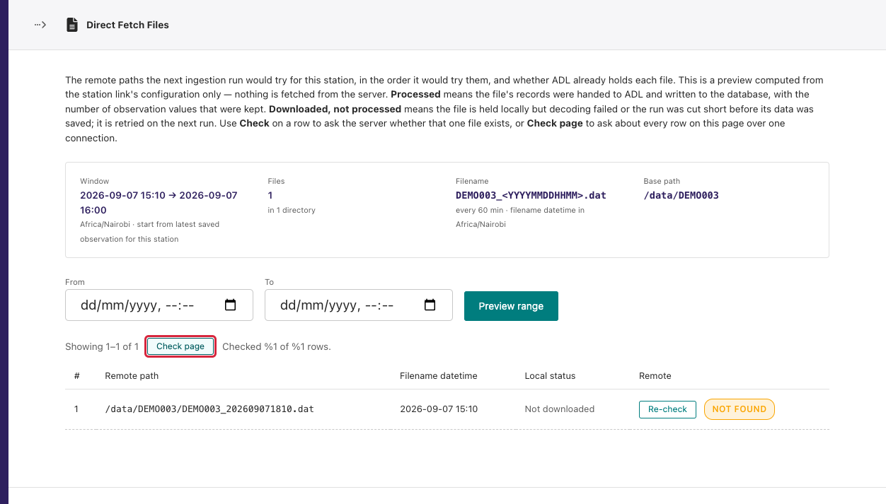

A window with no names shows `No filenames fall in this window. Check the
interval, the datetime format and the window bounds.` Opening the page for a
link that is not *Direct Fetch* explains that the list only applies to that
strategy and offers *Back to station link*.

### Remote Station Data Files

**Snippets → Remote Station Data Files** lists every file the plugin has
downloaded, newest first, filterable by station link. It is the first place to
look when a file arrived but nothing was stored.

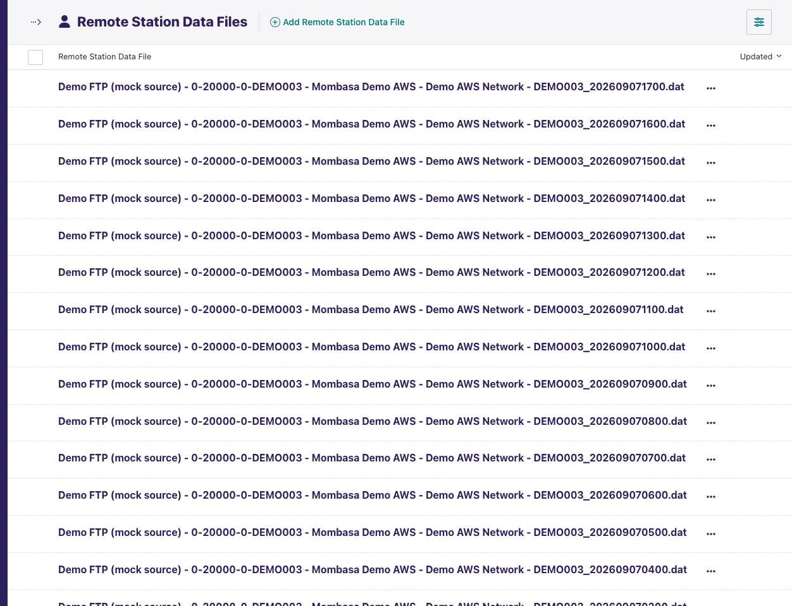

Open a row (Inspect) for its fields:

| Field | Meaning |
|---|---|
| Station link | The station link the file was fetched for. |
| File name | The name on the server. |
| File | The stored copy — download it to inspect or to feed *Test Decoder Configuration*. |
| Processed At | When this file's records were last handed to ADL and persisted. Empty: downloaded, never successfully decoded. |
| Values Saved | Observation values ADL saved from this file the last time it was processed. **0** means the file decoded but nothing was kept — typically a variable-mapping or ingestion-window mismatch. Empty for files processed before this was recorded, or on a core older than 0.8.12. |

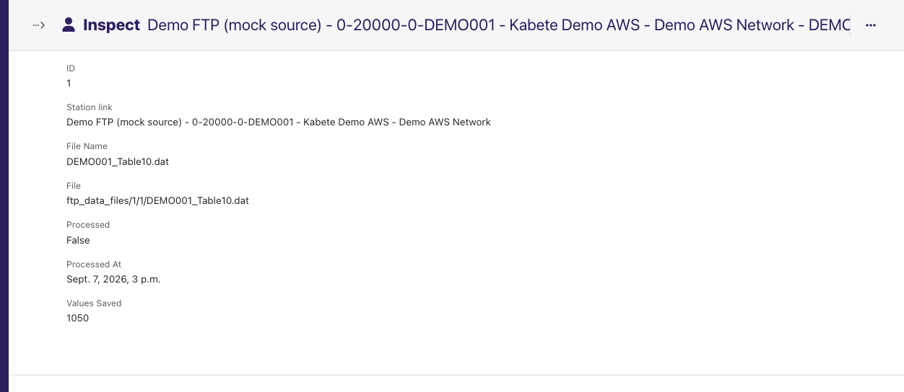

Stored files are **deleted seven days after they were processed** by a task
that runs every night at midnight (server time); unprocessed files are kept.
To clean up by hand:

```bash
docker compose exec adl adl cleanup_ftp_files --dry-run      # what would go
docker compose exec adl adl cleanup_ftp_files --days 3       # processed > 3 days ago
docker compose exec adl adl cleanup_ftp_files --all          # every stored file
```

Deleting a stored file also forgets that it was downloaded, so a file still
listed on the server and still matching the pattern is downloaded again on
the next run.

## Data collection behavior

- **Window.** Each run asks for the window from the later of the latest
  saved observation and *Collection Start Date*, to the top of the next hour
  in the station's timezone. With neither, the window starts **now** — an
  FTP link with no start date and no data fetches nothing older than the
  current hour. Set *Collection Start Date* for any backfill.
- **Directories.** With *Directory Structured by Date* on, the run visits one
  directory per period from the window start to now (Pattern Only and Filter
  by Date), or the one directory each expected file's timestamp belongs to
  (Direct Fetch). A directory that does not exist is logged (`Path
  /data/2025/09/08 not found`) and skipped, which is normal right after a
  day or hour rolls over.
- **Which files.** Pattern Only takes every name matching the pattern;
  Filter by Date keeps those whose trailing date falls in the window; Direct
  Fetch tries every constructed name up to now. The count of files the
  listing matched (or, for Direct Fetch, the count found on the server) is
  what the *Ingestion Diagnostic* reports as items the source offered.
- **Downloads.** A file ADL already holds for this station (same name) is
  not downloaded again while *Skip downloading already downloaded files* is
  on; its held copy is decoded again instead. With the option off, every
  selected file is downloaded every run. A download that fails is logged
  (`Error downloading file X: …`) and the file is retried next run; for
  Direct Fetch a missing file is expected and only logged at debug level.
- **Decoding and saving.** Each file is decoded whole and its records
  handed to ADL, which validates them against the variable mappings,
  converts units and upserts. A record already stored is updated, not
  duplicated, so re-decoding a growing file each run is safe. Only after ADL
  has written the records is the file stamped *Processed At* with *Values
  Saved*; a file whose decode fails stays unstamped (`Error decoding file X:
  <error>` in the task log) and is decoded again next run. A file that
  decoded but saved nothing logs `File X decoded 144 record(s) but none of
  its values were saved — check the variable mappings and the ingestion
  window`.
- **Backfill.** Set *Collection Start Date* before the first run. Filter by
  Date and Direct Fetch fetch exactly the dated files in the window; Pattern
  Only fetches whatever matches, and ADL keeps every decoded row from the
  start date on. A very large backfill on Direct Fetch generates one attempt
  per interval step — preview the count on the *Direct Fetch Files* page.
- **Timezones.** Three settings, three jobs. The **station's timezone**
  (connection default or per link) names the date directories and stamps the
  decoded observation times, which every built-in decoder reads as local
  wall-clock time. **Filename Date Timezone** and **File Datetime Timezone**
  only say how to read the dates *in file names*, for selecting or
  constructing files. A file named in UTC on a station in `Africa/Nairobi`
  therefore needs the filename timezone set to UTC and nothing else.
- **Retention.** Stored copies are removed seven days after processing (see
  *Remote Station Data Files*).

## Dispatch channels provided by this plugin

The plugin also registers two dispatch channel types, selectable when adding
a channel under **Dispatch Channels**. Base channel fields (name, network
connections, enabled, data check interval, dispatch timeout, records per
dispatch, aggregation, start date) and parameter mappings are described in
[Manage Dispatch Channels](https://adl-tool.readthedocs.io/en/latest/user_guide/manage_dispatch_channels.html);
the *Test connection*, *Dispatch now* and lock actions on a channel's
Station Links page in [Dispatch Troubleshooting](https://adl-tool.readthedocs.io/en/latest/user_guide/dispatch_troubleshooting.html).

### Standard FTP/SFTP Upload

Writes one CSV file per station on the destination server.

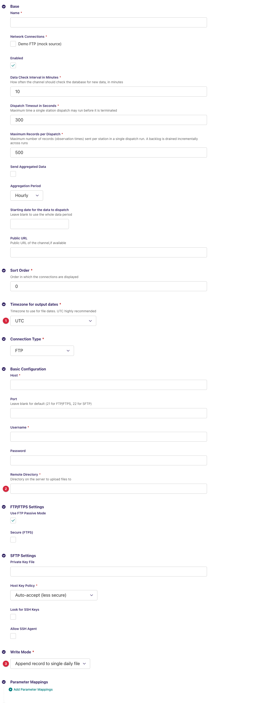

| Field | Required | Default | Description |
|---|---|---|---|
| Timezone for output dates | yes | UTC | The timezone the `date` and `time` columns (and the day in the file name) are written in. UTC is strongly recommended. |
| Connection Type | yes | FTP | FTP, FTPS or SFTP, as on the ingestion connection. |
| Host / Port / Username / Password | yes (password: see connection notes) | — / 21 or 22 | The destination account. Same rules as the ingestion connection, including the FTPS note about *Secure*. |
| Remote Directory | yes | — | Directory on the server to write under. Missing directories are created on upload. |
| Use FTP Passive Mode / Secure (FTPS) | no | on / off | FTP/FTPS only. |
| Private Key File / Host Key Policy / Look for SSH Keys / Allow SSH Agent | no | — / Auto-accept / off / off | SFTP only. |
| Write Mode | yes | Append record to single daily file | **Append**: one file per station and day, re-read from the server and rewritten with the new rows merged in by timestamp. **Create a new file for each record**: one file per observation. |
| Parameter Mappings | yes | — | Which ADL parameters to send, under which column name (*channel parameter*) and unit. |

Files are written to `<Remote Directory>/<station id>/`, where the station id
is the station's WIGOS id when it has one, otherwise its ADL station id:

| Write mode | File | Content |
|---|---|---|
| Append | `WIGOS_<station id>_<YYYYMMDD>.csv` | Header `station_id,wigos_id,date,time,<channel parameter…>` then one row per observation of that day, sorted by time. |
| New file | `WIGOS_<station id>_<YYYYMMDDTHHMMSS>.csv` | The same header and a single row. |

A record with no value for any mapped parameter is not written. Column
order follows the parameter mappings.

### SmartMet FTP/SFTP Upload

The same transport, shaped for the **FMI SmartMet** server's file import:
no header row, no station directory, one `timestamp` column instead of
`date`/`time`, and a stations metadata file uploaded alongside.

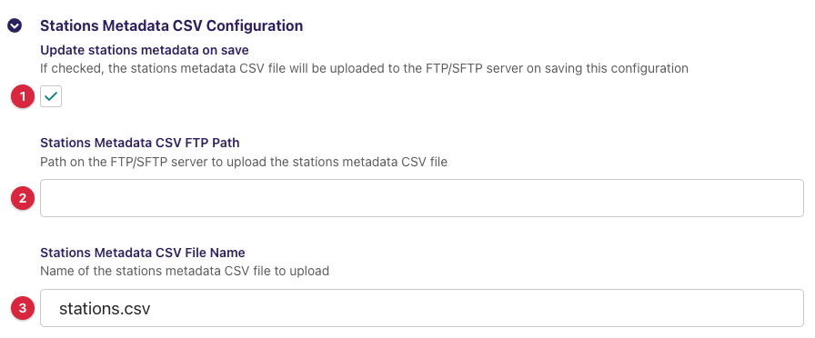

Fields not on the standard channel:

| Field | Required | Default | Description |
|---|---|---|---|
| Update stations metadata on save | no | on | Upload the stations metadata CSV to the server every time this channel is saved, and whenever its station links change. |
| Stations Metadata CSV FTP Path | when the above is on | — | Directory on the server for the metadata file. Left empty, the upload is skipped with a warning in the log. |
| Stations Metadata CSV File Name | no | `stations.csv` | Name of the metadata file. |

Output files go straight into `<Remote Directory>` (no station
sub-directory), named as for the standard channel, without a header, with
columns `station_id,timestamp,<channel parameter…>` where `timestamp` is
`YYYYMMDDTHHMMSS` in the channel's timezone. The **channel parameter names
must come from the server's known list**: the ADL setting
`SMARTMET_PARAMETER_NAMES` (a comma-separated environment variable on the
ADL container) is the list the mapping form offers, and a name outside it is
refused with `The provide channel parameter is not in the known list of
parameters`.

The stations metadata CSV has one row per linked station, without a header:
`<station number>,<station number>,<longitude>,<latitude>,<name>`, where the
station number is the station's ADL id. It is uploaded to `<Stations
Metadata CSV FTP Path>/<file name>` when the channel is saved *and enabled*
with host, username and directory set; failures are logged with the
`[SMARTMET METADATA]` prefix and never block saving.

### Test connection for FTP channels

On either channel's **Station Links** page, **Test connection** connects and
logs in with a 5-second bound, then disconnects. Success reads `Connected and
authenticated to ftp.example.org:21 as demo. Write access to /outgoing was
not tested.` — write access is deliberately not probed, since a probe would
leave files on a third party's server and a missing directory is created on
the first real upload anyway. A failure shows the client's message with its
code, for example `FTP Authentication failed (401)`; the *Feedback catalogue*
below explains each.

## Source checks / diagnostics

The plugin implements the ADL source-check contracts, so the core's
monitoring screens can tell a network fault, a login fault and a wrong path
apart *for this connection specifically*. The screens below are rendered by
the ADL core, but what they display for an FTP connection comes from this
plugin. The core's own messages on the same screens are catalogued in
[Monitoring & Diagnostics](https://adl-tool.readthedocs.io/en/latest/user_guide/monitoring_and_diagnostics.html).

### Where check results appear

**Ingestion Diagnostic page.** From the connections list, the Health column
of your FTP connection links to its **Ingestion Diagnostic** page
(`/monitoring/connection/<id>/health/`). It shows a layered verdict — DNS and
TCP reach of the host and port at the bottom, then whether the server
accepted the login — with a verdict history. **Probe source now** re-dials
the server immediately (at most once per minute); **Run ingestion now**
triggers a full collection cycle, which is what exercises listing, download
and decoding end to end.

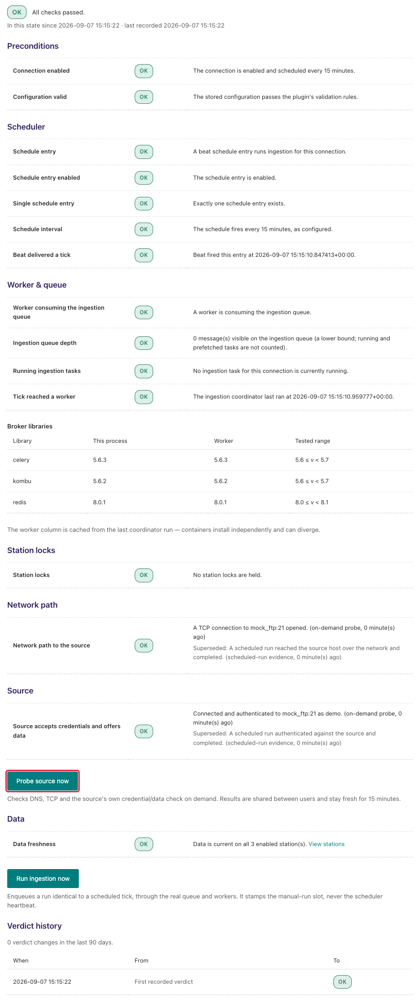

**Station Source Check panel.** Open a station link's **Inspect** page (from
the station links list, via the row's **…** menu). Alongside the Collection
Status card — which also offers **Trigger Collection Now** — the **Station
Source Check** card shows the latest station-level result: a status badge (OK
/ FAILED), when it was checked, the latency, and the message produced by this
plugin. **Check station source now** runs it fresh.

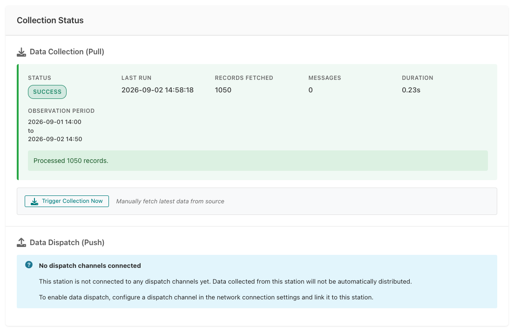

**Dashboard.** The *Data Pulling* tab of the ADL dashboard colours each
station of the connection by the age of its latest observation against the
processing interval — the quickest way to see that files are flowing.

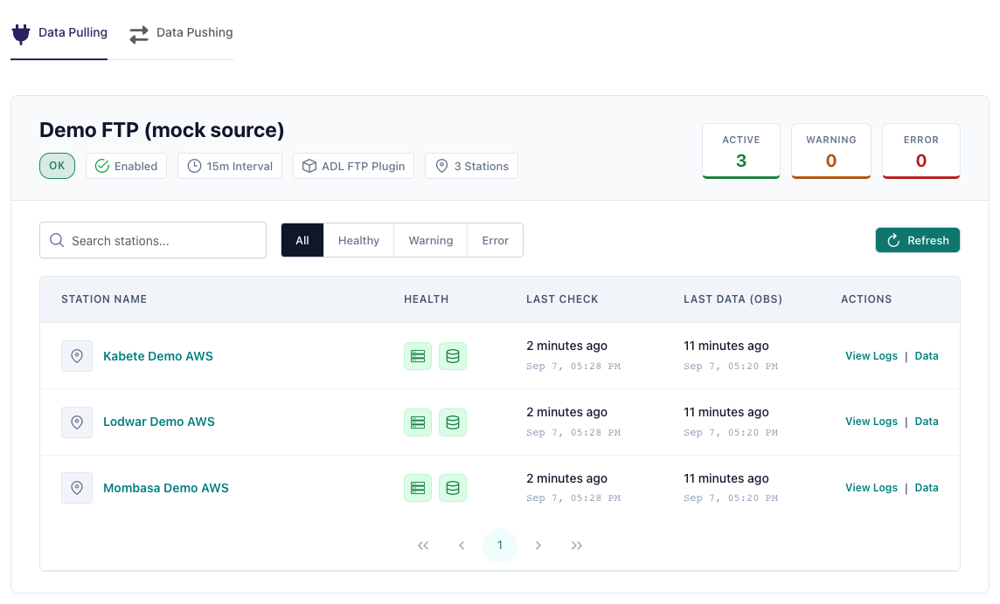

### What each check verifies

| Check | What it verifies |
|---|---|
| Endpoint probe | DNS resolution and TCP reach of *Host* and the effective *Port* (the entered port, or 21/22). Run by the core; the plugin only names the endpoint. |
| Connection check | Connects and logs in with the configured protocol and credentials, then disconnects. Nothing is listed or downloaded. Bounded to 5 seconds so the diagnostic always gets an answer. |
| Station check | Resolves the station's remote directory *for right now* (the current period's directory when structured by date), changes into it, lists it read-only, and counts the names matching the station's pattern (for Direct Fetch, `<prefix>*<extension>`). **Zero matches is OK** — a date-structured directory is legitimately empty just after a rollover — the count is there for you to judge. |

### Feedback catalogue — messages this plugin produces

Find the message you see. Connection-level messages appear on the Ingestion
Diagnostic's Source layer and in the *Probe source now* banner; station-level
ones on the Station Source Check card; client messages also surface in the
remote path browser, the *Direct Fetch Files* checks and the dispatch
channel's *Test connection*.

| Message (example) | Status | Meaning | What to do |
|---|---|---|---|
| `Connected and authenticated to ftp.example.org:21 as demo.` | OK | Host, port, protocol and credentials all work. | Nothing — healthy. |
| `Resolved remote path /data/DEMO001: 3 file(s) matching 'DEMO001_*.dat'.` | OK | The station's directory exists and the pattern matches that many names right now. | If the count is 0 when files should be there, compare the pattern with a real listing; if the resolved path is not what you expected, check *Directory Structured by Date* and the granularity. |
| `Resolved remote path /data/DEMO002/2025/09/08 was not found on the server.` | FAILED | The directory the station resolves to does not exist. Right after midnight on a date-structured tree this may simply mean today's directory is not created yet. | Check *Remote Path*, the granularity and *Month directory Format* against the server; re-check later if it is a rollover. |
| `FTP Authentication failed` | FAILED | The server refused the username/password (reply 530). | Re-enter *Username* and *Password*; confirm the account is active on the server. |
| `FTP permission error` | FAILED | The server refused a command for permission reasons (a 5xx reply other than login). | Check the account may read the directory; ask the server operator. |
| `Could not resolve FTP host` / `Could not resolve SSH host` | FAILED | DNS could not resolve *Host*. | Fix the host name, or use the IP address; check the ADL host's DNS. |
| `FTP host refused the connection` / `SSH host refused the connection` | FAILED | The host answered but nothing listens on that port. | Check *Port* and *Connection Type*; ask whether the service is running. |
| `FTP connection timed out` / `SSH connection timed out` | FAILED | No answer within the timeout — usually a firewall, or (FTP) a blocked passive data channel. | Check firewall rules from the ADL host; try toggling *Use FTP Passive mode*. |
| `TLS handshake with FTP server failed` | FAILED | FTPS was requested but the TLS negotiation failed. | Confirm the server offers FTPS on that port (explicit TLS on 21); otherwise use plain FTP or SFTP as the operator advises. |
| `FTP server temporarily unavailable` | FAILED | The server replied with a 4xx temporary error (too many connections, maintenance). | Retry; lower the connection's processing frequency if it is a connection limit. |
| `Unexpected reply from FTP server` | FAILED | The server sent a reply the client could not interpret — often a proxy or a non-FTP service on the port. | Check port and protocol. |
| `SSH Authentication failed` | FAILED | The SFTP server rejected the password or key. | Re-enter the password, or check *Private Key File Path* points at a readable, unencrypted key for this account. |
| `SSH host key verification failed` | FAILED | *Host Key Policy* is *Reject* (or the host's key changed) and the key is not trusted. | Use *Auto-accept* or *Warn*, or provision the server's key in the container's `known_hosts`. |
| `SSH error: <detail>` / `SFTP channel error: <detail>` | FAILED | Any other SSH-level failure; the detail is paramiko's message (a banner timeout, an unsupported key type, an account without SFTP access). | Read the detail; ask the server operator whether the account has SFTP enabled. |
| `Failed to list directory /data: <detail>` | FAILED | SFTP: the directory exists but could not be listed. | Check permissions on the directory. |
| `Directory /data/DEMO001 does not exist` | FAILED | SFTP: the resolved path is absent. | As for *was not found on the server*. |
| `Connecting to the server took too long.` | FAILED | *Direct Fetch Files* → *Check page*: the connect did not complete inside the sweep's budget. | Run *Probe source now* on the connection; the diagnostic names the layer. |
| `That path is not one this station link would generate.` | FAILED | *Direct Fetch Files* → *Check*: the path posted does not fit the link's prefix, extension and format (a stale page after editing the link). | Reload the page. |
| `This station link does not use Direct Fetch.` | FAILED | The check endpoints were called for a link on another strategy. | Nothing — use the preview only on Direct Fetch links. |

Messages in the **task log** (Monitoring → the connection's activity, and the
Collection Status card) for a run that connected but stored nothing:

| Message (example) | Meaning | What to do |
|---|---|---|
| `Decoder adcon_bf not found in decoder registry.` | The connection's decoder plugin is not installed on this instance; the run stops before listing. | Install the decoder plugin, or change *Decoder*. |
| `Decoder standard_csv selected but no CSV configuration set.` | Standard CSV without a configuration. | Set *CSV Configuration*. |
| `file_pattern is required for pattern_only strategy but is not set for station DEMO001. Skipping path /data/DEMO001.` | The link was saved without a pattern (only possible on very old data). | Enter a *File Pattern*. |
| `Path /data/DEMO002/2025/09/08 not found` | A period directory in the window is absent; the run continues with the next. | Normal at rollovers; otherwise check the tree settings. |
| `No files found for station DEMO001 matching pattern 'DEMO001_*.dat' in path /data/DEMO001` (debug) | The listing had no name matching the pattern (and, for Filter by Date, the window). | Compare the pattern with the listing; check *Filename Date Format* and timezone. |
| `direct_fetch_datetime_format is not set for station DEMO003. Cannot construct filenames.` / `Invalid datetime format for station DEMO003` | The Direct Fetch format is empty or unknown. | Choose a *File Datetime Format*. |
| `File DEMO003_202509071200.dat not found on server (expected for direct fetch), skipping.` (debug) | A constructed name does not exist yet. | Normal; if *every* name is missing, check prefix, extension, interval and *File Datetime Timezone* with the *Direct Fetch Files* checks. |
| `Error downloading file DEMO001_20250907.dat: <error>` | The download failed mid-way. | Retried next run; if persistent, check the file's permissions on the server. |
| `Error decoding file DEMO001_20250907.dat: <error>` | The decoder raised on this file — wrong decoder, corrupt file, or a format change upstream. | Download the file from *Remote Station Data Files* and run it through *Test Decoder Configuration*. |
| `File DEMO001_20250907.dat decoded 144 record(s) but none of its values were saved — check the variable mappings and the ingestion window` | The file parsed but no record key matched a mapping, or every row is older than the window/start date. | Compare mapping names with the preview headers; check *Collection Start Date*. |
| `Error parsing CSV row 12: …. Skipping row.` | Standard CSV: one row did not parse; the rest of the file is processed. | Inspect that row; adjust *No Data Value* or the datetime format if it recurs. |

## Troubleshooting

**Connection check passes, station check passes with 0 files, nothing is collected**
: The pattern matches nothing *right now* in the resolved directory. Take a
  real listing (the remote path browser shows directories only; use an FTP
  client for files) and compare with *File Pattern*. On a date-structured
  tree confirm the granularity and month format produce the directory you
  see on the server.

**Files are listed and downloaded, but *Values Saved* is 0**
: A *File Variable Name* differs from the decoded column name (case, spaces,
  a suffix like `_Avg`), or the rows are older than *Collection Start Date*.
  Run *Test Decoder Configuration* with the stored file and tick *Show only
  mapped variables*: an empty preview means no header matches.

**Only the first download of a growing file is ever stored**
: *Skip downloading already downloaded files* is on. Turn it off for
  loggers that append to one file (TOA5 tables, daily exports that fill up
  during the day).

**Filter by Date selects nothing, Pattern Only selects everything**
: The date is not the *last* thing before the extension, or the format's
  length does not match (`YYYYMMDD` on a name ending in `20250907_1200`).
  Change the format, or move to *Pattern Only* with a date-structured tree.

**Direct Fetch finds files hours late, or never**
: *File Datetime Timezone* is wrong: names in UTC read as local time are
  looked for before they exist. Use *Direct Fetch Files* → *Check page* to
  see which names exist and compare their datetimes with the server clock.

**Same file downloaded again a week later**
: Expected. Stored copies are deleted seven days after processing and with
  them the memory of the download; a name still matching the pattern is
  fetched again. Move to Filter by Date, or a date-structured tree, so old
  files leave the window.

**"TLS handshake with FTP server failed" or "SSL: SHUTDOWN_WHILE_IN_INIT"**
: The server wants explicit TLS with session reuse on the data channel,
  which the client handles — but only when *Connection Type* is **FTPS**
  *and* *Secure (FTPS)* is ticked. Check both; if the server only offers
  implicit TLS on port 990, it is not supported.

**SFTP works from a laptop but not from ADL**
: The key is not inside the container, is encrypted with a passphrase, or
  the account is restricted by source IP. Mount an unencrypted key and give
  its container path; ask the operator to allow the ADL host's address.

**A decoder plugin was upgraded and every run fails with a `TypeError` about `get_matching_files`**
: The decoder plugin predates FTP plugin 0.10.0, which passes the run's date
  window to decoders. Upgrade the decoder plugin (each guide names the
  compatible release).

**The dispatch channel writes files but SmartMet rejects them**
: The channel parameter names are not in `SMARTMET_PARAMETER_NAMES`, or the
  metadata CSV was never uploaded (empty *Stations Metadata CSV FTP Path*).
  Check the log for `[SMARTMET METADATA]` lines.

## Compatibility

| Plugin version | Requires ADL core | Notes |
|---|---|---|
| 0.13.0 | ≥ 0.8.12 for *Values Saved*, the per-file processed stamp and the source checks (runs on older cores with those features inactive) | Current release. Decoder plugins must accept the dated `get_matching_files()` signature introduced in 0.10.0. |
| 0.10.0 – 0.12.x | 0.8.x | Dated decoder API; earlier decoder plugins fail with a `TypeError`. |

## Changelog

See [GitHub Releases](https://github.com/wmo-raf/adl-ftp-plugin/releases).
